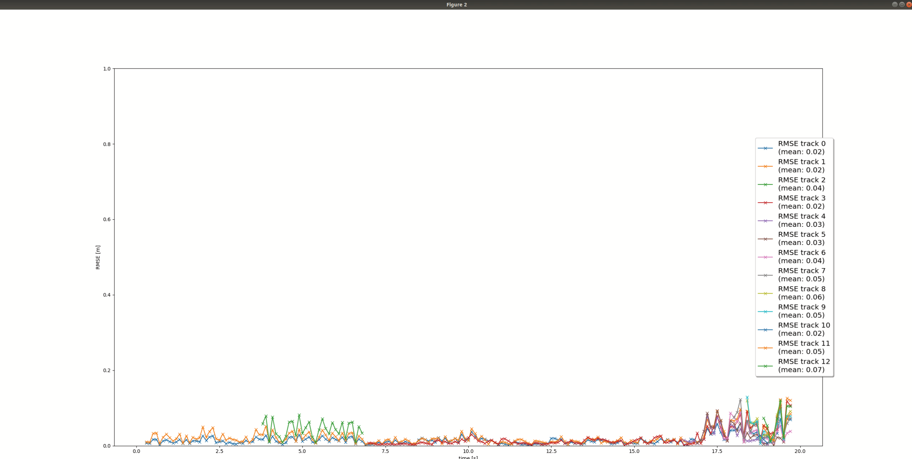
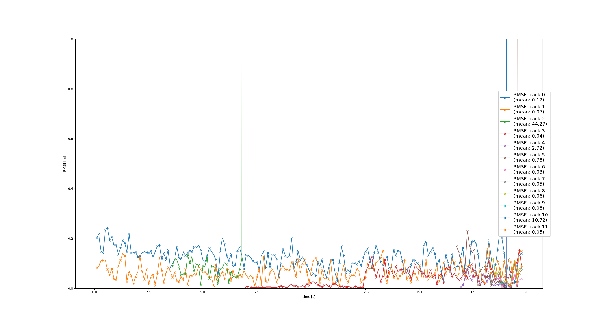

# Writeup: Track 3D-Objects Over Time

Please use this starter template to answer the following questions:

### 1. Write a short recap of the four tracking steps and what you implemented there (filter, track management, association, camera fusion). Which results did you achieve? Which part of the project was most difficult for you to complete, and why?

The final project consists of four main steps, where i have:

1. Implemented an extended Kalman filter.
2. Implemented track management including track state and track score, track initialization and deletion.
3. Implemented single nearest neighbour data association and gating.
4. Applied sensor fusion by implementing the nonlinear camera measurement model and a sensor visibility check.

After completing the final project, you will have implemented your own sensor fusion system that is able to track vehicles over time with real-world camera and lidar measurements!

### Step 3: Multi-Target Tracking with LiDAR only
Tracking result with tracks from Sequence 1:

 
  

Figure 1: RMSE for the valid tracks in Sequence 1 with LiDAR only
  

### Step 4: Multi-Target Tracking with the fusion of LiDAR and Camera 
Tracking result with tracks from Sequence 1:

 
  

Figure 2: RMSE for the valid tracks in Sequence 1 with the fusion of LiDAR and Camera
  

One of the most difficult part of project is to implemen the track management. The track management is responsible for the initialization and deletion of tracks, as well as the assignment of measurements to tracks. The track management is a crucial part of the tracking pipeline, as it ensures that the tracker is able to maintain a consistent and accurate estimate of the state of each target over time. The track management is responsible for the following tasks:

- Track Initialization: The track management is responsible for initializing new tracks when new measurements are received that do not match any existing tracks. This is done by creating a new track object and assigning the measurement to the track.
- Track Deletion: The track management is responsible for deleting tracks that have not received any measurements for a certain number of time steps. This is done to ensure that the tracker does not maintain tracks for targets that are no longer present in the scene.
- Measurement Assignment: The track management is responsible for assigning measurements to tracks based on their likelihood of originating from the target associated with the track. This is done using a data association algorithm, which assigns each measurement to the track that is most likely to have generated it.

The track management is a complex and challenging part of the tracking pipeline, as it requires careful design and implementation to ensure that the tracker is able to maintain accurate and consistent estimates of the state of each target over time. In particular, the measurement assignment step is challenging, as it requires the tracker to make decisions based on uncertain and noisy measurements, which can lead to errors in the tracking results if not handled properly. However, by carefully designing and implementing the track management, it is possible to achieve accurate and reliable tracking results in a wide range of scenarios.

### 2. Do you see any benefits in camera-lidar fusion compared to lidar-only tracking (in theory and in your concrete results)? 

**Reduced False Positives:** 

By cross-validating detections from both LiDAR and cameras, fusion systems can potentially reduce false positives that may occur when relying on a single sensor modality. This can lead to more reliable tracking and perception in complex environments with challenging scenarios like occlusions or dynamic lighting conditions. The evidence from the results shows that the performance of camera-lidar fusion has less occurance of having confirmed ghost tracks or track losses as compared to lidar-only tracking.

### 3. Which challenges will a sensor fusion system face in real-life scenarios? Did you see any of these challenges in the project?

1. Sensor Calibration:

    Challenge: Accurate calibration between sensors is critical to ensure that data from different sensors align correctly in space and time. Misalignment can lead to incorrect fusion results.

    Observation: In practice, maintaining precise calibration over time and under different environmental conditions can be difficult. Mechanical vibrations, temperature changes, and physical impacts can all cause calibration drift.

2. Synchronization:

    Challenge: Ensuring that data from different sensors is synchronized in time is crucial for accurate fusion. Asynchronous data can lead to temporal misalignment, where the information from one sensor is outdated relative to the other.

    Observation: In real-world projects, achieving and maintaining tight synchronization can be complex, especially with sensors operating at different frame rates and latencies.

3. Environmental Conditions:

    Challenge: Both LiDAR and cameras have their own limitations under certain environmental conditions. For instance, LiDAR can struggle with heavy rain or fog, while cameras can be affected by low light or glare.

    Observation: In projects, it’s common to encounter scenarios where one sensor underperforms, and the system needs to rely more heavily on the other sensor. This reliance can test the robustness of the fusion algorithms.

### 4. Can you think of ways to improve your tracking results in the future?
- Implement a more advanced data association, e.g. Global Nearest Neighbor (GNN) or Joint Probabilistic Data Association (JPDA).
- Use a non-linear motion model, e.g. a bicycle model, which is more appropriate for vehicle movement than our linear motion model, since a vehicle can only move forward or backward, not in any direction.